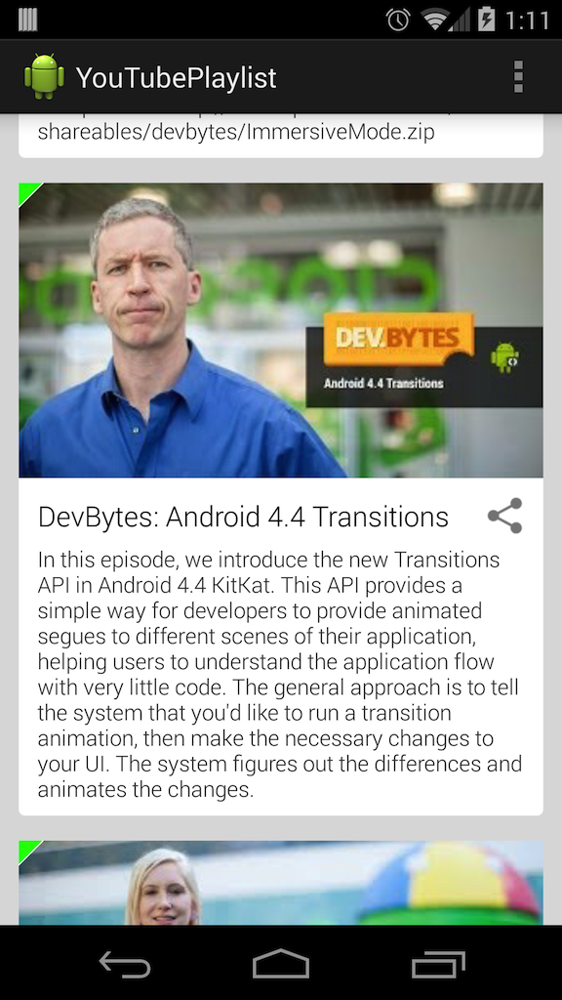

YouTubePlaylist
===============

A sample Android application which demonstrates the use of the [YouTube Data API v3](https://developers.google.com/youtube/v3/)
This sample app makes use of [Picasso](https://github.com/square/picasso) for downloading and caching the video thumbnails.
It also attemps to use [etag-cache](https://github.com/kevinsawicki/etag-cache) to optimize network load.

## Setup
  
  * Register your application with the [Google Developer Console](https://developers.google.com/youtube/registering_an_application)
  * Edit ApiKey.java and enter your applications "Browser Key"
  
## Dependencies

  * [com.android.support:support-v4:19.0.0]
  * [com.android.support:appcompat-v7:+]
  * [com.squareup.picasso:picasso:2.1.+](https://github.com/square/picasso)
  * [com.google.code.gson:gson:2.2.+](https://code.google.com/p/google-gson)
  * [com.github.kevinsawicki:etag-cache:0.6](https://github.com/kevinsawicki/etag-cache)
  
## License

  * [Apache 2.0](http://www.apache.org/licenses/LICENSE-2.0.html)
  
