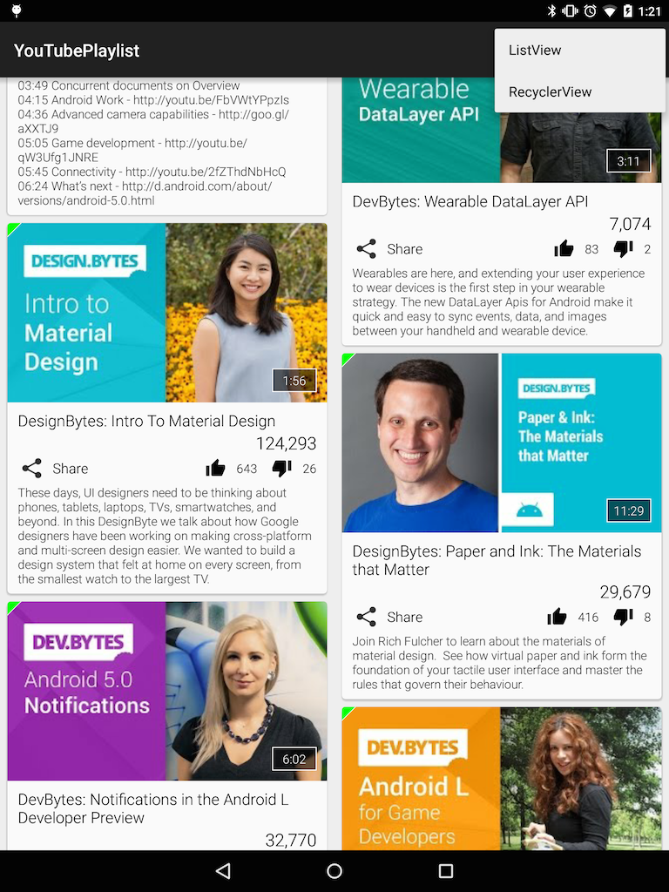
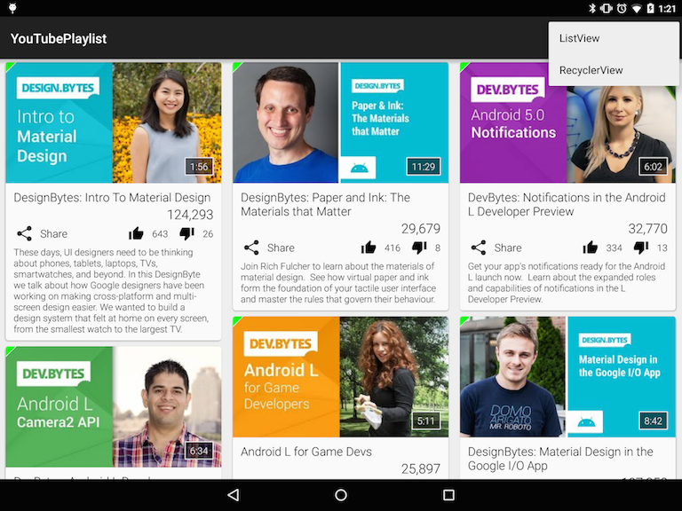

YouTubePlaylist
===============

A sample Android application which demonstrates the use of the [YouTube Data API v3](https://developers.google.com/youtube/v3/).

This sample app makes use of [Picasso](https://github.com/square/picasso) for downloading and caching the [PlaylistItem](app/src/main/java/com/akoscz/youtube/model/PlaylistItem.java) video thumbnail images.
It also uses [OkHttp](http://square.github.io/okhttp/) for HTTP response caching to avoid the network completely for repeat [requests](app/src/main/java/com/akoscz/youtube/GetYouTubePlaylistAsyncTask.java).
Lastly, [Gson](https://code.google.com/p/google-gson) is used to serialize the [Playlist](app/src/main/java/com/akoscz/youtube/model/Playlist.java) datamodel for persistance across orientation changes.

There are two examples of how to fetch and render a YouTube playlist.
   1. A Fragment with a simple [ListView](app/src/main/java/com/akoscz/youtube/YouTubeListViewFragment.java) where each [list item](app/src/main/res/layout/youtube_video_list_item.xml) mimicks the look of a CardView. <-- _deprecated._ __Use only for reference.__
   2. A Fragment with a [RecyclerView](app/src/main/java/com/akoscz/youtube/YouTubeRecyclerViewFragment.java) where each [list item](app/src/main/res/layout/youtube_video_card.xml) is a real  [CardView](https://developer.android.com/reference/android/support/v7/widget/CardView.html)

## Setup
  
  * Register your application with the [Google Developer Console](https://developers.google.com/youtube/registering_an_application).  You MUST register your application as a [Web Application](https://developers.google.com/youtube/registering_an_application#web-applications).
  * Create a ["Browser Key"](https://developers.google.com/youtube/registering_an_application#Create_API_Keys) NOT an Android key! 
  * Edit [ApiKey.java](app/src/main/java/com/akoscz/youtube/ApiKey.java) and update `YOUTUBE_API_KEY` with your applications "Browser Key"
  * Edit [YouTubeActivity.java](app/src/main/java/com/akoscz/youtube/YouTubeActivity.java) and update `YOUTUBE_PLAYLIST` to point to your YouTube [playlist](https://www.youtube.com/playlist?list=PLWz5rJ2EKKc_XOgcRukSoKKjewFJZrKV0).

*NOTE:* You MUST have a valid API key for this sample application to work. When you register your application with the Google Developer Console you need to enable the YouTube Data API.  Remember that you need to register a Web Application NOT an Android application because the API key that this sample app uses is the "Browser Key"!
  
## Dependencies

  * [com.android.support:cardview-v7:21.0.3](https://developer.android.com/tools/support-library/features.html#v7-cardview)
  * [com.android.support:recyclerview-v7:21.0.3](https://developer.android.com/tools/support-library/features.html#v7-recyclerview)
  * [com.android.support:support-v4:21.0.3](https://developer.android.com/tools/support-library/features.html#v4)
  * [com.android.support:appcompat-v7:21.0.3](https://developer.android.com/tools/support-library/features.html#v7-appcompat)
  * [com.squareup.picasso:picasso:2.5.2](https://github.com/square/picasso)
  * [com.squareup.okhttp:okhttp:2.4.0](http://square.github.io/okhttp)
  * [com.google.code.gson:gson:2.3.1](https://code.google.com/p/google-gson)

## Screenshots
__Phone__: Single Column Portrait and Landscape

__Tablet__: 7" and 9" (sw600)

2 Columns Portrait

3 Columns Landscape

__Tablet__: 10" (sw800) 3 Columns Portrait and Landscape

## License

  * [Apache 2.0](http://www.apache.org/licenses/LICENSE-2.0.html)
  
