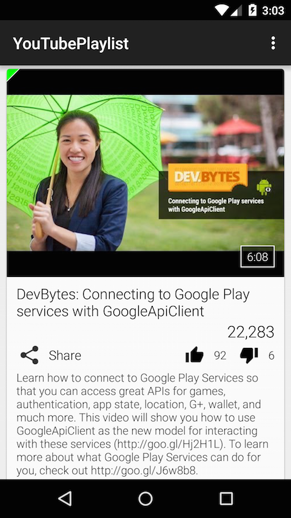
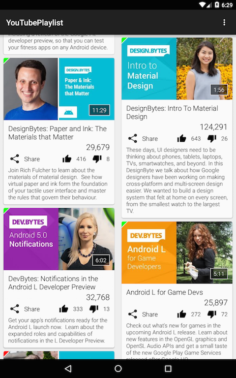
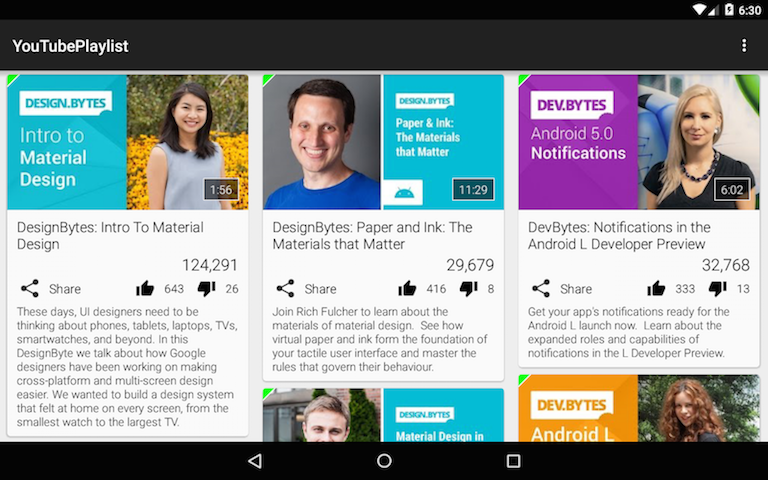
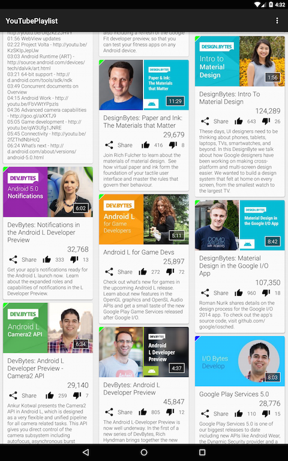

YouTubePlaylist
===============

A sample Android application which demonstrates the use of the [YouTube Data API v3](https://developers.google.com/youtube/v3/).

This sample app makes use of the [YouTube Data API v3 classes](https://developers.google.com/resources/api-libraries/documentation/youtube/v3/java/latest/) to fetch a YouTube [Playlist](https://developers.google.com/resources/api-libraries/documentation/youtube/v3/java/latest/com/google/api/services/youtube/model/Playlist.html) using the [GetPlaylistAsyncTask](app/src/main/java/com/akoscz/youtube/GetPlaylistAsyncTask.java) which then extracts the list of [Video](https://developers.google.com/resources/api-libraries/documentation/youtube/v3/java/latest/com/google/api/services/youtube/model/Video.html)'s the playlist contains.  The list of video's are then presented using a [RecyclerView](https://developer.android.com/reference/android/support/v7/widget/RecyclerView.html) of [CardView](https://developer.android.com/reference/android/support/v7/widget/CardView.html)'s in the [YouTubeRecyclerViewFragment](app/src/main/java/com/akoscz/youtube/YouTubeRecyclerViewFragment.java).  The data binding of video details to CardView is handled by the [PlaylistCardAdapter](app/src/main/java/com/akoscz/youtube/PlaylistCardAdapter.java).

[Picasso](https://github.com/square/picasso) is used for downloading and caching the video thumbnail images.
And lastly a [retained fragment](http://developer.android.com/guide/topics/resources/runtime-changes.html#RetainingAnObject) is used to persist the [PlaylistVideos](app/src/main/java/com/akoscz/youtube/model/PlaylistVideos.java) datamodel across orientation changes.

## Setup
  
  * Register your application with the [Google Developer Console](https://developers.google.com/youtube/registering_an_application).
  * Create an ["Api Key"](https://developers.google.com/youtube/registering_an_application#Create_API_Keys)
  * Edit [ApiKey.java](app/src/main/java/com/akoscz/youtube/ApiKey.java) and update `YOUTUBE_API_KEY` with your applications "Api Key"
  * Edit [YouTubeActivity.java](app/src/main/java/com/akoscz/youtube/YouTubeActivity.java) and update `YOUTUBE_PLAYLISTS` with a list of your YouTube [playlists](https://www.youtube.com/playlistVideos?list=PLWz5rJ2EKKc_XOgcRukSoKKjewFJZrKV0).

*NOTE:* You MUST have a valid API key for this sample application to work. Remember, when you register your application with the Google Developer Console you need to enable the YouTube Data API.
  
## Dependencies

  * [com.android.support:cardview-v7:25.2.0](https://developer.android.com/tools/support-library/features.html#v7-cardview)
  * [com.android.support:recyclerview-v7:25.2.0](https://developer.android.com/tools/support-library/features.html#v7-recyclerview)
  * [com.android.support:appcompat-v7:25.2.0](https://developer.android.com/tools/support-library/features.html#v7-appcompat)
  * [com.squareup.picasso:picasso:2.5.2](https://github.com/square/picasso)
  * [com.google.apis:google-api-services-youtube:v3-rev182-1.22.0](https://developers.google.com/api-client-library/java/apis/youtube/v3)
  * [com.google.http-client:google-http-client-android:1.20.0](https://github.com/google/google-http-java-client)
  * [com.google.api-client:google-api-client-android:1.20.0](https://github.com/google/google-api-java-client)
  * [com.google.api-client:google-api-client-gson:1.20.0](https://github.com/google/google-api-java-client)

## Screenshots
__Phone__: Single Column Portrait and Landscape

__Tablet__: 7" and 9" (sw600) 2 Columns Portrait, 3 Columns Landscape

__Tablet__: 10" (sw800) 3 Columns Portrait and Landscape

## License

  * [Apache 2.0](http://www.apache.org/licenses/LICENSE-2.0.html)
  
